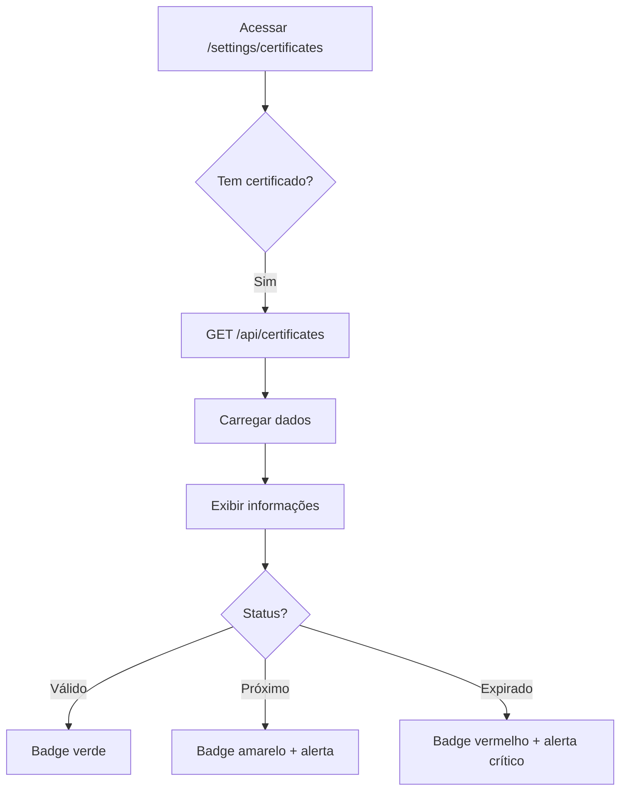

# 💻 Interface de Gerenciamento de Certificados

## 🎯 Visão Geral

Interface web completa para visualizar e gerenciar certificados digitais auto-gerenciados do SignFlow.

## 📍 Acesso

**URL:** `/settings/certificates`

**Navegação:** Dashboard → Configurações → Certificados Digitais

---

## ✨ Funcionalidades

### 1. Visualização do Certificado Atual

📊 **Informações Exibidas:**
- 🔑 Número de série
- 🏢 Emissor
- 🛡️ Titular
- 📅 Data de início da validade
- ⏰ Data de vencimento
- 🕒 Dias restantes até expiração
- ✅ Status (Válido / Próximo do Vencimento / Expirado)

### 2. Status Visual

🟢 **Válido:**
- Badge verde com ícone de check
- Mais de 30 dias até vencimento
- Sem alertas

🟡 **Próximo do Vencimento:**
- Badge amarelo com ícone de relógio
- Menos de 30 dias até vencimento
- Alerta sugerindo renovação

🔴 **Expirado:**
- Badge vermelho com ícone de alerta
- Certificado vencido
- Alerta crítico para renovar imediatamente

### 3. Ações Disponíveis

#### 🔄 Renovar Certificado
- Gera novo certificado automaticamente
- Desativa certificado atual
- Atualiza dados na interface
- Toast de confirmação

#### 🗑️ Limpar Cache
- Remove cache em memória
- Força recarregamento do banco
- Útil após mudanças manuais

#### 🔃 Atualizar Informações
- Recarrega dados do certificado
- Atualiza status em tempo real
- Sem modificações no certificado

#### 🏭 Inicializar Certificado
- Aparece quando não há certificado
- Gera primeiro certificado automaticamente
- Configura sistema pela primeira vez

---

## 📸 Screenshots (Conceito)

### Tela Principal - Certificado Válido

```
┌────────────────────────────────────────────────────────┐
│  🛡️  Certificados Digitais                 [ ✅ Válido ]  │
│  Gerencie certificados auto-gerenciados                    │
├────────────────────────────────────────────────────────┤
│                                                            │
│  📜 Certificado Atual                                    │
│  --------------------------------------------------------  │
│  🔑 Número de Série                                        │
│     1738604712345678                                       │
│                                                            │
│  🏢 Emissor                                                │
│     SignFlow Digital Platform                              │
│                                                            │
│  🛡️ Titular                                                │
│     SignFlow Digital Platform                              │
│                                                            │
│  📅 Período de Validade                                     │
│     Início:      03 de fevereiro de 2026, 15:00           │
│     Vencimento: 03 de fevereiro de 2036, 15:00           │
│     ----------------------------------------              │
│     Dias restantes: 3650 dias                             │
│                                                            │
├────────────────────────────────────────────────────────┤
│                                                            │
│  ⚙️ Ações                                                  │
│  --------------------------------------------------------  │
│  [🔄 Renovar Certificado]  [🗑️ Limpar Cache]         │
│  [🔃 Atualizar Informações]                              │
│                                                            │
├────────────────────────────────────────────────────────┤
│                                                            │
│  ℹ️ Sobre os Certificados Auto-Gerenciados                │
│  --------------------------------------------------------  │
│  ✅ Automático: Gerados automaticamente                    │
│  ✅ Seguro: Armazenados criptografados                   │
│  ✅ Compatível: Reconhecidos por Adobe Reader            │
│  ✅ Validade: 10 anos renováveis                          │
│                                                            │
└────────────────────────────────────────────────────────┘
```

### Tela - Certificado Próximo do Vencimento

```
┌────────────────────────────────────────────────────────┐
│  🛡️  Certificados Digitais      [ ⚠️ Próx. Vencimento ] │
├────────────────────────────────────────────────────────┤
│                                                            │
│  ⚠️ ALERTA                                                 │
│  Atenção: Seu certificado vencerá em 15 dias.           │
│  Considere renová-lo em breve.                             │
│                                                            │
│  [detalhes do certificado...]                             │
│                                                            │
│  Dias restantes: 15 dias (⚠️ amarelo)                     │
│                                                            │
└────────────────────────────────────────────────────────┘
```

### Tela - Sem Certificado

```
┌────────────────────────────────────────────────────────┐
│  🛡️  Certificados Digitais                              │
├────────────────────────────────────────────────────────┤
│                                                            │
│  ℹ️ INFO                                                  │
│  Nenhum certificado encontrado.                           │
│  Clique em "Inicializar" para gerar automaticamente.     │
│                                                            │
├────────────────────────────────────────────────────────┤
│                                                            │
│  📜 Certificado Atual                                    │
│  --------------------------------------------------------  │
│                                                            │
│              📄                                           │
│        Nenhum certificado                                  │
│          configurado                                       │
│                                                            │
│       [🛡️ Inicializar Certificado]                       │
│                                                            │
└────────────────────────────────────────────────────────┘
```

---

## 💻 Componentes Utilizados

### shadcn/ui Components

- `Card` - Container principal
- `Button` - Ações e botões
- `Badge` - Indicadores de status
- `Alert` - Avisos e alertas
- `Separator` - Divisores visuais

### Ícones (Lucide React)

- `Shield` - Segurança/Certificados
- `FileKey` - Arquivo de certificado
- `Key` - Número de série
- `Server` - Emissor
- `Calendar` - Datas
- `Clock` - Tempo restante
- `RefreshCw` - Renovar/Recarregar
- `Trash2` - Limpar cache
- `Download` - Atualizar
- `AlertTriangle` - Alertas
- `CheckCircle2` - Válido
- `Info` - Informações
- `Settings` - Configurações

---

## 🔄 Fluxo de Uso

### 1. Primeiro Acesso (Sem Certificado)

```mermaid
graph TD
    A[Acessar /settings/certificates] --> B{Tem certificado?}
    B -->|Não| C[Exibir tela vazia]
    C --> D[Botão "Inicializar"]
    D --> E[Clique do usuário]
    E --> F[POST /api/certificates action=initialize]
    F --> G[Gerar certificado no banco]
    G --> H[Exibir certificado gerado]
    H --> I[Toast: Certificado criado!]
```

### 2. Visualizar Certificado Existente



### 3. Renovar Certificado

```mermaid
graph TD
    A[Botão "Renovar"] --> B[Confirmação do usuário]
    B --> C[POST /api/certificates action=renew]
    C --> D[Desativar certificado atual]
    D --> E[Gerar novo certificado]
    E --> F[Salvar no banco]
    F --> G[Recarregar dados na interface]
    G --> H[Toast: Certificado renovado!]
    H --> I[Exibir novo certificado]
```

---

## 🎨 Design System

### Cores de Status

| Status | Cor | Uso |
|--------|-----|-----|
| **Válido** | Verde (`text-green-600`) | Mais de 30 dias |
| **Próximo** | Amarelo (`text-yellow-600`) | Menos de 30 dias |
| **Expirado** | Vermelho (`text-red-600`) | Data passada |

### Espaçamento

- Cards: `gap-6` entre eles
- Conteúdo interno: `space-y-4`
- Botões: `gap-3` entre ícones e texto

### Tipografia

- Título principal: `text-3xl font-bold`
- Títulos de card: `CardTitle`
- Labels: `text-sm font-medium text-muted-foreground`
- Valores: `text-sm` ou `font-mono` (número de série)

---

## 🔒 Segurança

### Proteção de Dados Sensíveis

✅ **Chave privada NÃO é exibida** na interface  
✅ **Apenas metadados públicos** são mostrados  
✅ **API requer autenticação** (implementar middleware)  
✅ **Operações logadas** para auditoria  

### Recomendações

1. **Adicionar autenticação:**
```typescript
// middleware.ts
export function middleware(req: NextRequest) {
  if (req.nextUrl.pathname.startsWith('/settings/certificates')) {
    // Verificar se usuário é admin
    const session = await getSession();
    if (!session?.user?.isAdmin) {
      return NextResponse.redirect('/dashboard');
    }
  }
}
```

2. **Rate limiting:**
```typescript
// Limitar renovações para evitar abuso
const renewRateLimit = rateLimit({
  interval: 60 * 60 * 1000, // 1 hora
  uniqueTokenPerInterval: 500
});
```

---

## 📦 Deploy

### Checklist

- [ ] Aplicar migration do banco de dados
- [ ] Instalar dependência `node-forge`
- [ ] Configurar variável `SIGNFLOW_CERTIFICATE_PASSWORD` (opcional)
- [ ] Testar geração de certificado
- [ ] Testar renovação
- [ ] Verificar responsividade mobile
- [ ] Adicionar link na navegação principal

### Vercel

```bash
# Build local
npm run build

# Deploy
vercel --prod

# Configurar variável de ambiente
vercel env add SIGNFLOW_CERTIFICATE_PASSWORD
```

---

## 📱 Responsividade

A interface é **totalmente responsiva**:

### Desktop (> 1024px)
- Layout de 2 colunas para botões de ação
- Cards com largura máxima de 6xl
- Espaçamento generoso

### Tablet (768px - 1024px)
- Layout adaptado
- Botões em 2 colunas
- Cards empilhados

### Mobile (< 768px)
- Botões em coluna única
- Texto responsivo
- Padding reduzido

---

## 🧪 Testes

### Testes Manuais

1. **Certificado válido:**
   - Acessar `/settings/certificates`
   - Verificar badge verde
   - Verificar dados corretos

2. **Renovar certificado:**
   - Clicar em "Renovar"
   - Aguardar loading
   - Verificar toast de sucesso
   - Verificar novo número de série

3. **Limpar cache:**
   - Clicar em "Limpar Cache"
   - Verificar toast
   - Dados devem permanecer iguais

4. **Sem certificado:**
   - Limpar tabela no banco
   - Acessar página
   - Ver tela vazia
   - Clicar "Inicializar"
   - Verificar criação

### Testes Automatizados (Futuro)

```typescript
// __tests__/certificates-page.test.tsx
import { render, screen, fireEvent } from '@testing-library/react';
import CertificatesPage from '@/app/(dashboard)/settings/certificates/page';

describe('CertificatesPage', () => {
  it('should display certificate info', async () => {
    render(<CertificatesPage />);
    expect(await screen.findByText('SignFlow Digital Platform')).toBeInTheDocument();
  });

  it('should renew certificate', async () => {
    render(<CertificatesPage />);
    const renewButton = screen.getByText('Renovar Certificado');
    fireEvent.click(renewButton);
    expect(await screen.findByText('Certificado renovado')).toBeInTheDocument();
  });
});
```

---

## 🔗 Links Úteis

- [Código da Página](../app/(dashboard)/settings/certificates/page.tsx)
- [API de Certificados](../app/api/certificates/route.ts)
- [Gerenciador de Certificados](../lib/certificateManager.ts)
- [Migration do Banco](../supabase/migrations/20260203_signflow_certificates.sql)

---

## 🚀 Próximas Melhorias

- [ ] Gráfico de validade ao longo do tempo
- [ ] Histórico de certificados anteriores
- [ ] Download de certificado público (.pem)
- [ ] Notificações por email antes do vencimento
- [ ] Dashboard de estatísticas (nº de PDFs assinados)
- [ ] Suporte para múltiplos certificados simultâneos
- [ ] Testes E2E com Playwright
- [ ] Exportar relatório PDF do certificado

---

**Desenvolvido com ❤️ pelo time SignFlow**
